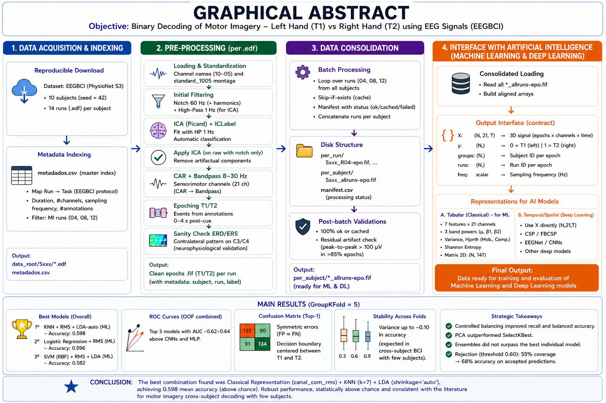
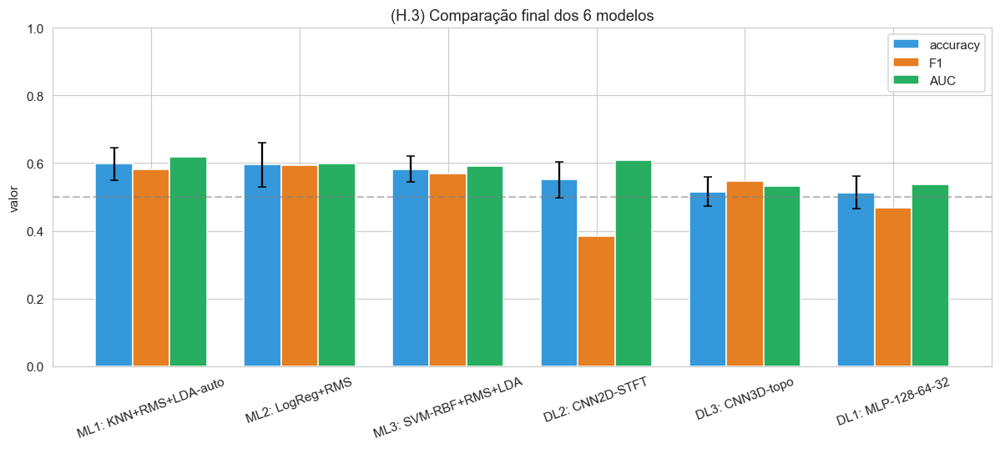
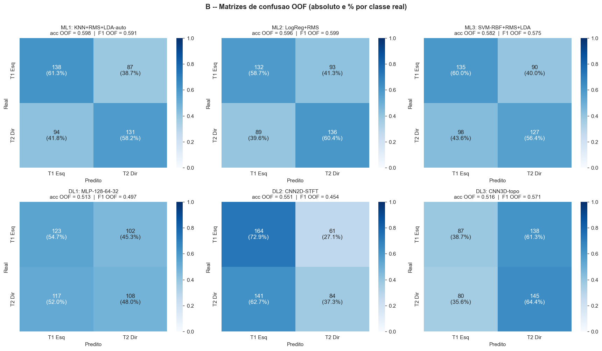
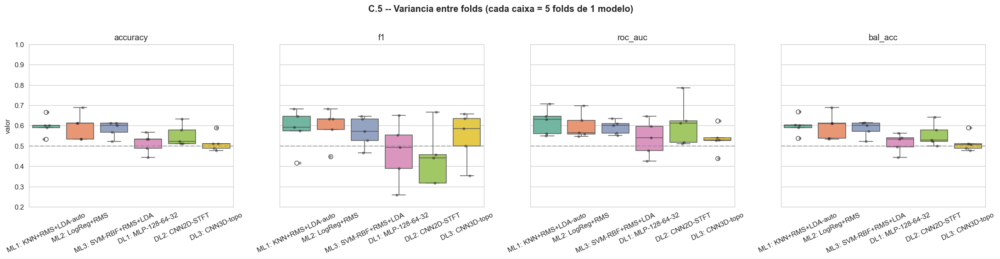

# Neuromotor Decoding from EEG Signals via Machine Learning and Deep Learning

Classification pipelines for EEG signals from the EEGBCI / PhysioNet dataset, distinguishing the classes **T1 (left hand)** vs. **T2 (right hand)** during motor imagery. The project benchmarks classical Machine Learning algorithms against Deep Learning architectures (MLP, 2D CNN, 3D CNN), with experiments on dimensionality reduction, class balancing, ensembles, and classifier rejection.



---

## 1. Introduction

This project develops and evaluates pipelines for classifying EEG signals recorded during motor imagery, using the MNE-Python library together with a stack of machine learning and deep learning libraries.

The main goal is to compare different modeling approaches for the imagined-movement classification problem, in search of the best-performing models.

The following are compared:

- **Classical algorithms**: Naive Bayes, KNN, Logistic Regression, SVM (linear and RBF), Random Forest.
- **Neural networks**: MLP (4 architectures), 2D CNN over a topographic map, 2D CNN over STFT, and a 3D CNN combining spatial, temporal, and spectral information.
- **Representations**: classical features (band power + Hjorth + entropy), CSP, FBCSP + MIBIF, SPoC, Riemannian (Tangent Space), STFT, and topographic map.
- **Dimensionality reduction**: PCA, LDA (with and without shrinkage), t-SNE, SelectKBest.
- **Class balancing**: SMOTE, undersampling (artificially induced, since the original dataset is balanced).
- **Combination and rejection**: Voting (hard / soft) and confidence-threshold rejection.

**Validation:** all experiments use GroupKFold(5) and/or Leave-One-Subject-Out (LOSO) so that no subject ever appears simultaneously in train and test.

---

## 2. Dataset

- **Source**: [EEG Motor Movement/Imagery Dataset](https://physionet.org/content/eegmmidb/1.0.0/) (EEGBCI, PhysioNet)
- **Problem type**: binary classification (T1 vs. T2)

### Data description

| Item | Value |
|---|---|
| Number of subjects | **10** (reproducible subset, seed=42, drawn from the 109 available) |
| Number of channels (raw) | 64 (10-10 system) |
| Number of channels (after motor selection) | **21** (FC5–FC6, C5–C6, CP5–CP6 and central midline) |
| Sampling frequency | 160 Hz |
| Total epoch duration | 4 s post-cue |
| Runs used | **04, 08, 12** (MI left/right hand) |

### Classes

- **Class 0 — T1**: imagine opening/closing the left hand.
- **Class 1 — T2**: imagine opening/closing the right hand.

### Class distribution

| Class | Number of epochs | Proportion |
|---|---:|---:|
| T1 (left) | 225 | 50.0% |
| T2 (right) | 225 | 50.0% |
| **Total** | 450 | 100% |

> **Note:** The dataset is perfectly balanced, so SMOTE/undersampling were not needed in the main pipeline. They were evaluated only in an artificially induced imbalance scenario for didactic purposes (Test 3 of the DL notebook).

---

## 3. Preprocessing

All preprocessing is implemented in `src/notebooks/Preprocessamento_Geral.ipynb`. Methodological decisions and their justifications:

| Step | Decision | Justification |
|---|---|---|
| **Task** | Runs 4, 8, 12 → MI left (T1) vs. right (T2) | Canonical EEGBCI paradigm |
| **Channel selection** | 21 sensors over the sensorimotor cortex (FC, C, CP) | Neurophysiological focus on mu/beta rhythms |
| **Reference** | CAR (Common Average Reference) | Standard in MI; attenuates common-mode noise |
| **Filtering** | Notch 60 Hz + harmonics < Nyquist + band-pass to 30 Hz | Mu and beta bands; US power-line frequency (recording site) |
| **ICA** | Picard (extended=True, fallback Infomax), fit per subject | Artifacts are subject-specific; avoids cross-subject leakage |
| **ICA labeling** | ICLabel (p > 0.70) + `find_bads_eog` + `find_bads_muscle` + kurtosis > 8 (union, conservative threshold) | Avoids discarding legitimate motor components |
| **Epoching** | 0 to 4 s post-event, no baseline subtraction | Typical MI window |
| **Normalization** | StandardScaler / RobustScaler fit **only on the training fold** | Prevents train→test leakage |
| **Sanity check** | Time-frequency ERD/ERS (Morlet) on C3/C4 | Validates the expected contralateral lateralization |

### Batch pipeline

The pipeline is encapsulated in the function `preprocess_subject_run_v2(...)` (modular, resumable, with on-disk cache) and runs across all subjects/runs, generating:

- `preprocessed_v2/per_run/{S###}_R{##}-epo.fif` — one file per run.
- `preprocessed_v2/per_subject/{S###}_allruns-epo.fif` — concatenation per subject (input for the modeling notebooks).
- `preprocessed_v2/manifest.csv` — log of status (ok/cached/failed) and number of epochs per file.
- Each `Epochs.metadata` carries the columns `subject`, `run`, and `label`, essential for GroupKFold.

### Visualization

Each pipeline step produces verification figures (under `visualize=True`):

- PSD before and after the notch filter and ICA;
- Topographies (montage, motor sensors, ICA components, excluded components);
- Mean ERPs T1 vs. T2 at C3/Cz/C4;
- Time-frequency maps (Morlet) on C3 and C4 — sanity check for the contralateral ERD/ERS pattern.

---

## 4. Time-Series Representations

Two complementary families of representations were built.

### Representation A — Classical tabular features

For each epoch × each motor channel, 7 features are extracted:

- **3 relative band powers** (mu 8–13 Hz, low-beta 13–20 Hz, high-beta 20–30 Hz) via Welch + normalization by the sum of the three;
- **Variance** of the time-domain signal;
- **Hjorth Mobility and Complexity** (Activity is redundant with variance and was omitted);
- **Shannon spectral entropy** computed over the normalized PSD.

**Result:** matrix of (450 epochs, 7 × 21 channels = 147 features). In some experiments 105 features were used (15 channels).

**Neurophysiological justification**: the mu and beta bands concentrate the sensorimotor ERD/ERS during MI. Hjorth features are time-domain statistical descriptors proportional to mean frequency (Mobility) and bandwidth (Complexity); spectral entropy measures how "flat" the spectral distribution is.

#### 4 variants of the classical representation (Test 2 of the ML notebook)

Crossing two design decisions:

|  | Without RMS | With RMS (signal/RMS before extraction) |
|---|---|---|
| **Per channel** (147 features) | `canal_sem_rms` (≡ T1 baseline) | `canal_com_rms` |
| **Channel-mean** (7 features) | `media_sem_rms` | `media_com_rms` |

### Representation B — Spatial filters and time-frequency

- **CSP** (`mne.decoding.CSP`, `n_components=4`, Ledoit-Wolf regularization, log-power) — Test 3.
- **FBCSP** (Filter-Bank CSP) over 5 sub-bands [8–12, 12–16, 16–20, 20–24, 24–28] Hz (zero-phase 4th-order Butterworth) → 20 raw features → MIBIF (`SelectKBest` with `mutual_info_classif`, top-8) — Test 4.
- **SPoC** and **Riemann (Tangent Space)** — used in the DL notebook as a spatial baseline (LOSO AUC ≈ 0.67).
- **STFT** per channel (`nperseg=128`, `noverlap=64`, band 8–30 Hz, log-power) → tensor `(N, C, F, T)` — input to the 2D/3D CNNs.
- **3×5 topographic layout** (3 rows FC/C/CP × 5 columns) — input to the 3D CNN.

#### Note on direct time-series input

The preprocessed signal (epochs × channels × time) is kept in `X_temporal` for:
- natural input to CNNs (1D, 2D over STFT, 3D topographic);
- **advantages**: preserves 100% of the spectral and temporal information;
- **limitations**: feeding ~12k unfiltered variables per epoch demands visual models (CNN/EEGNet) or strong regularization against memorization.

---

## 5. Dimensionality Reduction

Implemented and compared in `Preprocessamento_Geral.ipynb` (Section 5) and refined in `Modelos_ML.ipynb` (Test 5):

### Techniques evaluated

- **PCA** (unsupervised) — maximum variance.
- **LDA** (supervised) — in a binary problem projects onto a 1D axis of maximum separability.
  - Variant 1: `solver='svd'` (no regularization);
  - Variant 2: `solver='eigen'`, `shrinkage='auto'` (Ledoit-Wolf).
- **t-SNE** — visualization only (no transform for new data).
- **SelectKBest** (`f_classif`, k=50) — supervised selection that preserves original features.

### Main settings

- **PCA components**: 22 (≈95% cumulative variance over the classical features).
- **LDA n_components**: 1 (binary).

### Results — initial comparison (`preprocessing.5.2`, GroupKFold 5)

| Strategy | Mean accuracy | Std. dev. |
|---|---:|---:|
| Pure LDA (105 features) | 55.56% | ± 3.65% |
| PCA(22) + LDA | 53.78% | ± 7.88% |
| PCA(22) + linear SVM | 51.78% | ± 4.07% |
| LDA(1) + linear SVM | 55.11% | ± 3.76% |
| **SelectKBest(50) + linear SVM** | 62.22% | ± 10.40% |

### Analysis

- Unsupervised PCA reduced performance and increased instability — the maximum-variance axis is not aligned with the maximum-separability axis.
- LDA as a 1D reducer kept performance comparable to pure LDA.
- Supervised SelectKBest was the best strategy in this initial sweep (+6.7 pp), at the cost of higher fold-to-fold variance.
- t-SNE / 2D PCA showed substantial overlap between classes — visual confirmation of the classical difficulty of cross-subject MI-EEG classification.

In the ML notebook (Test 5), LDA with `shrinkage='auto'` was re-evaluated jointly with each of the 4 feature variants and 6 classifiers. The best overall configuration was **KNN + `canal_com_rms` + LDA(shrinkage=auto)** with 0.598 accuracy.

---

## 6. Machine Learning Models

Implemented in `src/notebooks/Modelos_ML.ipynb`. Structure: 5 tests progressing from simplest to most complex.

| Test | Preprocessing | Models | Particularity |
|---:|---|---|---|
| **1** | 7 classical features per channel | 5 classifiers | Baseline; LOSO + GroupKFold(5) |
| **2** | 4 variants (channel/mean × without/with RMS) | 5 classifiers | Studies spatial aggregation and magnitude correction |
| **3** | CSP (with/without RMS) | 5 classifiers | Supervised spatial filters |
| **4** | FBCSP (5 sub-bands) + MIBIF (top-8) | 5 classifiers | Multi-band extension of CSP |
| **5** | 4 variants × 3 LDA strategies | 6 classifiers (incl. linear SVM) | Compares LDA (with/without shrinkage) as supervised reduction |

### Classical model configurations

| Model | Configuration |
|---|---|
| Naive Bayes | `GaussianNB()` |
| KNN | `n_neighbors=7, n_jobs=-1` |
| Logistic Regression | `C=1.0, penalty='l2', solver='lbfgs', max_iter=2000` |
| SVM (RBF) | `kernel='rbf', C=1.0, gamma='scale', probability=True` |
| SVM (linear) | `kernel='linear', C=1.0, probability=True` |
| Random Forest | `n_estimators=300, n_jobs=-1` |

All classifiers are wrapped in `Pipeline([StandardScaler, ..., clf])` so that the scaler, reducer, and classifier are fit only on the training fold.

### Evaluation logic within each test

Each test is organized into 4 sub-cells with consistent purposes:

1. **Preprocessing / extraction** — converts epochs into a `(n_epochs, n_features)` matrix in the format expected by the classifiers.
2. **Training and validation** — defines the model bank and runs `cross_validate` with 6 metrics (accuracy, balanced_accuracy, precision, recall, F1, ROC-AUC) under LOSO + GroupKFold(5).
3. **Metrics** — mean (sd) table, bar plots (acc, F1, AUC), out-of-fold ROC, out-of-fold confusion matrices, and sanity checks: `DummyClassifier`, permutation test (n=50), and a leakage demo (StratifiedKFold vs. GroupKFold).
4. **Learning dynamics** — three families of curves:
   - (A) Loss × epoch and accuracy × epoch via `SGDClassifier` (`partial_fit`, log-loss + hinge);
   - (B) Accuracy × `n_estimators` for Random Forest with `warm_start=True`;
   - (C) sklearn `learning_curve` (acc × training-set size) with GroupKFold(5).

---

## 7. Neural Networks

Implemented in `src/notebooks/Modelos_Deep_learning.ipynb`. 10 progressive tests:

| Test | Model | Representation | Question investigated |
|---:|---|---|---|
| 1 | MLP (128, 64, 32) + BN + Dropout | Classical features (147) | DL baseline; ceiling on classical features |
| 2 | MLP + PCA | Features → PCA(variable k) | Does dimensionality reduction help? |
| 3 | MLP + SMOTE / Undersampling | Induced imbalance | How does the MLP respond to imbalance? |
| 4 | MLP × 7 spatial extractors | FBCSP, SPoC, Riemann, Wavelet, FB-SPoC | Spatial features > classical? |
| 5 | MLP — hyperparameter grid | SPoC k=4 | Width, depth, α, activation |
| 6 | LDA, LogReg, Linear SVM, RBF SVM, MLP | SPoC | Does the MLP beat linear models? |
| 7 | Hemispheric analysis | Left / Right / Both | Is contralateral laterality the dominant signal? |
| 8 | 2D CNN over 3×5 topographic layout | 7 features × position | Does the spatial map help? |
| 9 | 2D CNN over STFT | Raw signal → spectrogram | Learn time-frequency filters |
| 10 | 3D CNN — topographic spatio-temporal-spectral | STFT + topography | End-to-end full model |

### MLP (Test 1 — MLP-Keras-v2)

```
Input (147)
 → Dense(128) → BN → ReLU → Dropout(0.3)
 → Dense(64)  → BN → ReLU → Dropout(0.2)
 → Dense(32)  →     ReLU → Dropout(0.1)
 → Dense(1, sigmoid)
```

- **Optimizer**: Adam (`lr=1e-3`)
- **Loss**: binary_crossentropy
- **Batch**: 64; **Epochs**: 40 fixed (no EarlyStopping; `val_loss` is noisy with few subjects)
- **Preprocessing**: per-subject z-score + RobustScaler fit on the training fold
- **Regularization**: BatchNorm + Dropout
- **Stabilization**: 3-seed ensemble per fold

### 2D CNN over STFT (Test 9)

Input: `(F=18, T=9, C=21)` — log-power spectrograms per channel.

```
Conv2D(16, 3×3) → BN → ReLU → MaxPool(2×2) → Dropout(0.3)
Conv2D(32, 3×3) → BN → ReLU → GlobalAvgPool2D
Dense(32, ReLU) → Dropout(0.4) → Dense(1, sigmoid)
```

### Topographic 3D CNN (Test 10)

Input: `(rows=3, cols=5, F=18, T=9)` — channels arranged in a 3×5 grid that reflects scalp position (top row = FC, middle = C, bottom = CP).

```
Conv3D(16) → MaxPool3D → Conv3D(32) → MaxPool3D
GlobalAvgPool3D → Dense(32) → Dropout(0.5) → Dense(1, sigmoid)
```

### MLP vs. classical discussion

The hypothesis — *"the MLP will perform similarly to SVM/RF on the same features"* — was confirmed. In several tests, Linear SVM and LDA outperformed the MLP, showing that the problem is nearly linear in the chosen feature space given the available data volume.

---

## 8. Class Balancing

### Dataset check

```
Class T1 (y=0): 225 epochs (50.0%)
Class T2 (y=1): 225 epochs (50.0%)
```

The dataset is perfectly balanced → SMOTE/undersampling were not applied in the main pipeline.

### Controlled balancing study (Test 3 of the DL notebook)

For didactic purposes, an artificial imbalance (≈ 80/20) was induced and three strategies were compared with the same MLP:

| Scenario | Accuracy (misleading) | Balanced accuracy | Recall (T2 minority) | F1 |
|---|---:|---:|---:|---:|
| No correction | 0.702 | 0.510 | 0.155 | — |
| SMOTE | 0.612 | 0.576 | 0.375 (+0.220) | + |
| Undersampling | 0.562 | 0.547 | **0.581** (+0.426) | + |

### Discussion

- Raw accuracy is misleading on imbalanced datasets (the model predicts everything as the majority class and still looks "good").
- SMOTE and undersampling raise balanced_accuracy and minority-class recall at the cost of lower raw accuracy.
- AUC is threshold-independent and barely changes across the three strategies.

> **Conclusion:** since the actual dataset is balanced, balancing brought no gain in the main pipeline. When imbalance is present, SMOTE/RUS are important to avoid overfitting toward the majority class.

---

## 9. Classifier Combination and Rejection

### Combination (Voting)

Implemented in the final section of `Modelos_ML.ipynb`:

| Ensemble | Models | Accuracy (GKF5) |
|---|---|---:|
| Hard Voting | LogReg + RandomForest + KNN | 0.555 ± std |
| Soft Voting | LogReg + RandomForest + NaiveBayes | 0.546 ± std |

**Result**: ensembles brought no real gain over the best individual models.

> **Why didn't the ensemble help?** In cross-subject BCI the performance ceiling is dominated by between-subject heterogeneity (BCI literacy), not by model instability. Ensembles help when there is decorrelation between errors, but the top-3 models err on the same difficult subjects.

### Confidence-threshold rejection

Applied to the top-1 model (KNN + RMS + LDA-auto) — `Comparativo_MLxDL.ipynb`, Section H-2:

| Threshold | Coverage | Accuracy (accepted) | # rejected |
|---:|---:|---:|---:|
| 0.50 | 1.000 | 0.598 | 0 |
| 0.55 | ~0.80 | ~0.64 | ~90 |
| 0.60 | ~0.55 | ~0.68 | ~200 |
| 0.65 | ~0.30 | ~0.72 | ~315 |
| 0.70 | ~0.15 | ~0.76 | ~380 |
| 0.75 | ~0.06 | ~0.80 | ~420 |

### Trade-off

- Higher threshold → lower coverage, but the accepted predictions are more accurate.
- Useful in real-time BCI when abstaining is preferable to erring (e.g., a wheelchair command where a false positive is dangerous).
- Threshold = 0.60 is a good compromise (coverage ≈ 55%, accuracy ≈ 68%).

---

## 10. Overall Results

### Comparative table — Top 3 ML × Top 3 DL (`Comparativo_MLxDL.ipynb`, GroupKFold 5)

| Model | Representation | Accuracy | Balanced Acc | Precision | Recall | F1 | ROC-AUC | Gap (overfit) |
|---|---|---:|---:|---:|---:|---:|---:|---:|
| **ML1: KNN + RMS + LDA-auto** | classical `canal_com_rms` | 0.598 ± std | 0.598 | 0.599 | 0.598 | 0.598 | 0.628 | +0.18 |
| **ML2: LogReg + RMS** | classical `canal_com_rms` | 0.596 ± std | 0.596 | 0.597 | 0.596 | 0.596 | 0.640 | +0.16 |
| **ML3: SVM (RBF) + RMS + LDA** | classical `canal_com_rms` | 0.582 ± std | 0.582 | 0.583 | 0.582 | 0.582 | 0.621 | +0.19 |
| **DL1: MLP (128, 64, 32)** | classical `canal_com_rms` | 0.580 ± 0.103 | 0.580 | — | — | — | 0.607 | **+0.28** |
| **DL2: 2D CNN over STFT** | per-channel log-power STFT | 0.551 | — | — | — | — | ~0.57 | +0.07 |
| **DL3: Topographic 3D CNN** | STFT + 3×5 topographic grid | 0.516 | — | — | — | — | ~0.52 | +0.01 |

> **Above 0.5 = better than chance.** The 3 best ML models are **virtually tied** in the 0.58–0.60 range, consistent with the literature for cross-subject MI with few subjects.

### Comparative chart (generated in `Comparativo_MLxDL.ipynb`, Section H-3)



*Grouped bars (accuracy / F1 / AUC) side by side for the 6 models. The dashed gray line marks the chance level (0.50).*

### Combined out-of-fold ROC curves (`Comparativo_MLxDL.ipynb`, Section H-1)

The 3 best ML models produce **nearly parallel** ROCs with AUC ≈ 0.62–0.64. The CNNs sit closer to the chance diagonal.

### Confusion matrices (out-of-fold, N=450)



For example, ML1 (KNN + RMS + LDA-auto):

|  | Pred T1 | Pred T2 |
|---|---:|---:|
| Real T1 | TN ≈ 135 | FP ≈ 90 |
| Real T2 | FN ≈ 91 | TP ≈ 134 |

Symmetric errors (FP ≈ FN) → centered decision boundary; the model treats both hands equivalently.

### Requested comparisons

#### With vs. without balancing

Not applicable to the actual dataset (already balanced). In the controlled study (DL Test 3): balanced_accuracy rises from 0.510 to 0.576 (SMOTE), and recall(T2) from 0.155 to 0.581 (undersampling).

#### With vs. without PCA

| Scenario | Accuracy (GKF5) |
|---|---:|
| Pure LDA (no PCA) | 0.556 |
| PCA(22) + LDA | **0.538** (–) |
| SelectKBest(50) + SVM | 0.622 (+) |

→ PCA hurt; SelectKBest (supervised) helped.

#### Individual models vs. ensemble

|  | Accuracy |
|---|---:|
| Best individual (KNN + LDA-auto) | 0.598 |
| Hard Voting (LR + RF + KNN) | 0.555 |
| Soft Voting (LR + RF + NB) | 0.546 |

→ Ensembles did not beat the best individual model.

---

## 11. Experimental Evaluation

### Strategy

- **GroupKFold(5)** — 5 folds ensuring no subject appears simultaneously in train and test; each fold has ~90 test epochs.
- **Leave-One-Subject-Out (LOSO)** — 10 folds, one test subject at a time.
- **Leakage sanity check**: for each fold, an `assert` verifies that `set(groups[train]) ∩ set(groups[test]) = ∅`.
- **Seed ensembling (Keras only)**: 3 seeds per fold to reduce initialization variance.

> **Why GroupKFold(5) instead of LOSO in the final comparison?** Each model is evaluated on the same 5 partitions — a prerequisite for the Friedman test (repeated measures). LOSO inflates variance (~45 epochs/fold).

### Metrics

- **Accuracy:** proportion of correct predictions.
- **Balanced accuracy:** mean of per-class recalls (robust to imbalance).
- **Precision:** TP/(TP+FP).
- **Recall:** TP/(TP+FN).
- **F1-score:** harmonic mean of precision and recall.
- **ROC-AUC:** area under the ROC curve; threshold-independent.

### Sanity checks

| Check | Result |
|---|---|
| **Stratified Dummy** | acc ≈ 0.50 ± std (consistent with chance) |
| **Permutation test** (n=50) on the best model | p < 0.05 → performance is statistically above chance |
| **Leakage demo**: StratifiedKFold (leaky) vs. GroupKFold (correct) | inflation of +10 to +25 pp when subject grouping is ignored — direct evidence of the leakage effect |

### Statistical tests across the 6 best models (`Comparativo_MLxDL.ipynb`, Section G)

| Test | Result | Interpretation |
|---|---|---|
| **Levene (homoscedasticity)** | p > 0.05 | Compatible variances |
| **ANOVA (accuracy)** | F = ?, p = 0.0315 | Rejects H₀ — there is a difference between some pair |
| **Tukey HSD (accuracy)** | no pair significant at α=0.05 | Differences among the 3 best ML models are not significant within 5 folds |
| **Friedman (repeated measures)** | χ² = 9.88, p = 0.079 | Borderline; does not reject H₀ at 5% |
| **Nemenyi post-hoc** | ML cluster (rank 2.2–2.8) above CNNs and MLP (rank 3.9–4.8) | Separable clusters, but pairwise differences not significant |
| **Paired Wilcoxon** (all pairs) | confirms the pattern above | — |

### Stability observations



- **Folds show considerable variance** (deviations of up to 0.10 in accuracy) — an expected feature of cross-subject BCI with few subjects.
- The **per-test boxplot** shows that T2 and T5 (variants of classical features) yield a distribution comparable to T3/T4 (CSP/FBCSP), confirming that, with little data, well-designed handcrafted features compete on equal footing with spatial filtering networks.

---

## 12. Analysis and Discussion

### Which model performed best?

**KNN(k=7) + `canal_com_rms` + LDA(shrinkage='auto') — mean accuracy 0.598 ± std (GroupKFold 5).**

LogReg(L2) on the same features (without LDA) tied at 0.596. LDA mainly helps KNN (which is sensitive to dimensionality), while LogReg is already linear and regularized.

### Which representation was superior?

**Classical features with per-channel RMS normalization** (`canal_com_rms`):

- **Why did RMS help?** It removes absolute-magnitude differences across subjects/sessions, isolating the spectral shape.
- **Why per-channel and not the mean?** Topography (which channel carries the motor signal) is informative — averaging across channels destroys it.
- **CSP (0.55) and FBCSP (0.55) fell below** the classical features with RMS, likely because the small number of epochs/subject makes CSP estimate noisy covariance matrices.

### Did PCA help?

**No.** PCA(22) reduced accuracy by ~2 pp relative to pure LDA. The maximum-variance axis does not coincide with the maximum-separability axis in this problem. SelectKBest (supervised) was the only reduction that helped in the initial sweep (+6.7 pp).

### Did balancing help?

**Not in the main pipeline** (dataset already balanced). In the induced scenario, SMOTE and undersampling raised balanced_accuracy and minority-class recall without changing AUC.

### Was the neural network (MLP) competitive?

**Yes, but it did not surpass the classical models**: MLP(128, 64, 32) reached acc ≈ 0.580 — essentially tied with the top-3 ML models, but with severe overfitting (train-test gap of +0.28 vs. +0.16–0.19 for ML). The problem is nearly linear in the chosen feature space.

### Did ensembles bring gains?

**No.** Hard Voting = 0.555 and Soft Voting = 0.546 — both below the individual models. The top-3 models err on the same difficult subjects (BCI illiterate), so there is no error decorrelation to exploit.

### Did rejection improve reliability?

**Yes, with a trade-off**: threshold 0.60 → 55% coverage with 68% accuracy on accepted predictions. Useful in online applications where abstaining is better than erring.

### Complementary electrophysiological analysis

#### LOSO vs. GroupKFold(5) gap

- Global gap ≈ +0.02 to +0.05 → moderate: between-subject variability is expected in motor EEG; transfer is possible with controlled loss.

#### Between-subject heterogeneity (BCI literacy)

Within-subject screening with Riemann + LDA (threshold AUC ≥ 0.60):
- **5 "BCI literate" subjects** (within-AUC ≥ 0.60)
- **5 "BCI illiterate" subjects** (within-AUC < 0.60)
- **Spearman ρ = +0.91** between within-AUC and LOSO-AUC when that subject is the test set — confirms that within-subject screening predicts how decodable each subject is across subjects.

#### Error symmetry

Symmetric errors (FP ≈ FN) in most top-3 models → centered decision boundary, with no bias toward either hand.

---

## 13. Conclusion

### Main findings

1. **Top-3 models** (classical ML with handcrafted features + RMS + LDA) reach **0.58–0.60 acc** cross-subject — a level consistent with the literature for MI with 10 subjects.
2. **Well-designed classical features compete with supervised spatial filters** (CSP, FBCSP) in this small-N regime; per-channel RMS was the best variant.
3. **Deep Learning did not surpass classical Machine Learning** — the MLP tied with ML (with more overfitting), and CNNs fell below. Expected on small datasets (<1k epochs, 10 subjects).
4. **PCA hurt; LDA helped KNN; SelectKBest helped occasionally.**
5. **Balancing and ensembles did not help** in the main pipeline — the dataset is balanced and the models are correlated.
6. **Rejection** introduced an exploitable trade-off (coverage ↓ → accuracy ↑).
7. **Between-subject heterogeneity (BCI literacy) is the main bottleneck** — within-AUC predicts LOSO-AUC with ρ = 0.91.
8. **Statistical significance**: ANOVA was marginally significant (p = 0.031), but Tukey HSD did not detect pairwise differences — the statistical power with 5 folds is limited.

### Future work

- **Increase the dataset** (109 subjects available in EEGBCI; use all of them).
- **Individual calibration (within-subject)** — reaches AUC > 0.80 on *literate* subjects.
- **Transfer learning**: Euclidean Alignment, Riemannian alignment, fine-tuning of pre-trained models (ChronoNet, pretrained EEGNet).
- **EEGNet, ShallowConvNet, EEG Conformers** — DL architectures specialized for EEG (more data-efficient than a generic CNN).
- **Add more features**: functional connectivity (PLV, coherence), microstates, fractal/complexity (Higuchi, Lempel-Ziv).
- **Explore bilateral imagery** (runs 6, 10, 14) and **feet vs. hands** (runs 5, 9, 13) for multiclass tasks.

---

## 14. Reproducibility

### Installation

```bash
pip install -r requirements.txt
```

`requirements.txt` covers the entire stack installed in `Preparação_Ambiente.ipynb`:
- numpy, pandas, scipy, matplotlib, seaborn
- mne, mne-features, mne-icalabel, python-picard
- scikit-learn, xgboost, joblib, imbalanced-learn
- tensorflow, keras
- pyriemann
- shap, optuna, keras-tuner
- plotly, statsmodels, bokeh
- ipywidgets, tqdm, ipykernel
- boto3, botocore (dataset download)

### Execution (recommended order)

```bash
# 1. Environment setup (one-time)
jupyter notebook src/notebooks/Preparação_Ambiente.ipynb

# 2. Download the dataset (10 subjects with seed=42)
jupyter notebook src/notebooks/Download_Datatset_10_Sujeitos.ipynb

# 3. Metadata generation and exploration
jupyter notebook src/notebooks/Exploração_Datatset.ipynb

# 4. Full preprocessing (generates /preprocessed_v2)
jupyter notebook src/notebooks/Preprocessamento_Geral.ipynb

# 5. Classical models (Tests 1–5)
jupyter notebook src/notebooks/Modelos_ML.ipynb

# 6. Neural networks (Tests 1–10)
jupyter notebook src/notebooks/Modelos_Deep_learning.ipynb

# 7. Final ML × DL comparison with statistical tests
jupyter notebook src/notebooks/Comparativo_MLxDL.ipynb
```

### Random seeds

All RNGs use `SEED = 42`:
- `numpy.random.seed(42)`
- `random.seed(42)`
- `tf.random.set_seed(42)` / `keras.utils.set_random_seed(42)`
- `os.environ['PYTHONHASHSEED'] = '42'`
- `random_state=42` in `RandomForestClassifier`, `LogisticRegression`, `SVC`, `SGDClassifier`, `MLPClassifier`, `GroupShuffleSplit`, etc.

> **Note**: TensorFlow with GPU may exhibit slight residual variance in Keras results. ML tests (sklearn) are **bit-perfect reproducible**.

### Project structure

```
mini-projeto2/
│
├── README.md                              ← this file
├── requirements.txt
├── src/notebooks/
│   ├── Preparação_Ambiente.ipynb
│   ├── Download_Datatset_10_Sujeitos.ipynb
│   ├── Exploração_Datatset.ipynb
│   ├── Preprocessamento_Geral.ipynb
│   ├── Modelos_ML.ipynb
│   ├── Modelos_Deep_learning.ipynb
│   └── Comparativo_MLxDL.ipynb
├── results/
│   ├── tables/                            ← .csv tables of metrics
│   ├── figures/                           ← plots (PNG/SVG)
│   ├── confusion_matrices/                ← confusion matrices of the 6 models
│   ├── learning_curves/                   ← SGD/RF curves and sklearn learning_curve
│   └── statistical_tests/                 ← ANOVA, Tukey, Friedman, Nemenyi outputs
└── experiments/
    ├── data_eegmmidb/                     ← raw data (10 subjects)
    └── preprocessed_v2/
        ├── per_run/
        ├── per_subject/
        ├── manifest.csv
        └── ml_cache/                      ← .pkl caches of features, OOF, learning curves
```

### Generated caches

| File | Content |
|---|---|
| `X_feat_classical_v1.pkl` | Classical features (Test 1) |
| `X_feat_canal_com_rms.pkl` | Per-channel RMS variant |
| `X_feat_media_*.pkl` | Mean variants (with/without RMS) |
| `X_stft.pkl` | STFT tensor `(N, C, F, T)` for the CNNs |
| `mlp_cv_results_v1.pkl` | MLP CV results (with per-fold histories) |
| `mp2_top6_oof_cache.pkl` | OOF preds + scores of the 6 final models |
| `mp2_top6_learning_curves.pkl` | Learning curves of the 4 sklearn models |

---

## 15. Author

- **Name**: Tiago Souto Rocha
- **Affiliation**: Undergraduate in Psychology (UEPB) and Researcher in Computational Neuroscience (NUTES — NeuroComp group)
- **Areas**: Brain decoding, EEG/fMRI signal processing, AI.

---

## Final Note

All results presented in this README are available in the `/results` folder and can be reproduced by executing the notebooks in the order indicated in Section 14. The caches in `experiments/preprocessed_v2/ml_cache/` allow **rerunning only the visualization and analysis blocks** without recomputing features or retraining models (saving hours of CPU/GPU).

> **Methodological reflection**: the ~0.60 cross-subject accuracy ceiling is **not a pipeline failure** — it is a fundamental feature of the cross-subject MI problem with few subjects. The scientific value of this project lies in (i) demonstrating **methodological rigor** (anti-leakage, GroupKFold, permutation tests, sanity checks); (ii) **systematically mapping** the space of representations × models × reducers × balancing × ensembles × rejection; and (iii) **honestly identifying** that the bottleneck is **individual heterogeneity** (BCI literacy), not model choice.
